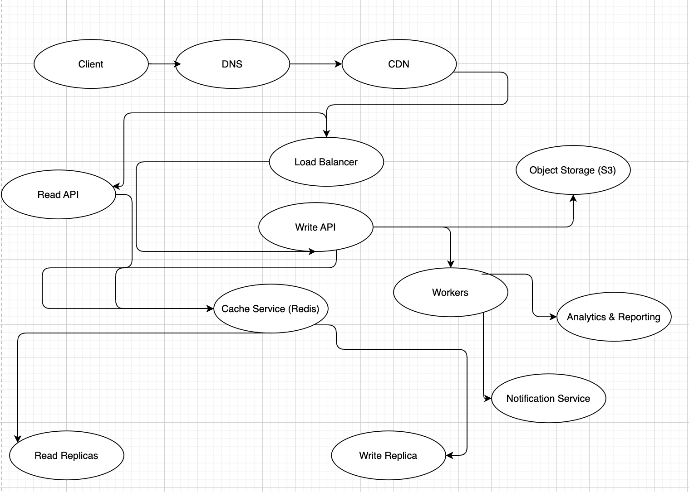

# Instagram News Feed Architecture: Likes and Comments Only

## Step 1: Define Use Cases and Constraints

### Use Cases
We focus on the news feed that includes photos and videos, and analyze interactions limited to likes and comments:

1. **Display functionality:**
   - Show the total likes on a post.
   - Show the total comments on a post.
   - Render content (photos/videos) of the post.

2. **Interaction functionality:**
   - User likes or unlikes a post.
   - User comments on a post.
   - User retrieves the list of users who liked a post.
   - User retrieves the list of comments on a post.

3. **Notification functionality:**
   - Notify users of new likes or comments.

### Constraints
1. Scalability: Service handles **50,000 RPS for feed requests**, **50,000 RPS for likes**, and **10,000 RPS for comments**.
2. Media limits:
   - Video: Max 60 seconds, up to 100 MB.
   - Photo: Max 5 MB.
   - Each post may include up to 9 media files.
3. Database efficiency:
   - Ensure consistency for likes and comments counts.
   - Provide paginated responses for lists (comments, likes).
4. High availability for seamless user experience.
5. No support for threaded comments, updates/removal of comments, or likes on comments.

---

## Step 2: Usage Calculation

### RPS (Requests Per Second)
1. **Feed Requests:** 50,000 RPS.
2. **Likes:** 50,000 RPS.
3. **Comments:** 10,000 RPS.

### Storage / Data Size
#### **Post**
```json
{
    "post_id": "uuid/String",
    "user_id": "uuid/String",
    "caption": "String",
    "media_links": "String[9]",
    "media_type": "Int",
    "created_at": "timestamp",
    "updated_at": "timestamp",
    "likes": {
        "count": "Int",
        "users": "uuid[]"
    },
    "comments": [
        {
            "id": "uuid/String",
            "user_id": "uuid/String",
            "text": "String",
            "created_at": "timestamp"
        }
    ]
}
```

#### **API Models**
- **Get Likes Response:**
    ```json
    {
        "entities": [
            {
                "user_id": "uuid/String",
                "username": "String",
                "photo_link": "String"
            }
        ],
        "page": "Int",
        "pageSize": "Int"
    }
    ```
- **Get Comments Response:**
    ```json
    {
        "entities": [
            {
                "id": "uuid/String",
                "user": {
                    "user_id": "uuid/String",
                    "username": "String",
                    "photo_link": "String"
                },
                "text": "String",
                "created_at": "String"
            }
        ],
        "page": "Int",
        "pageSize": "Int"
    }
    ```

---

## Step 3: Architecture Design

### High-Level Components
1. **Client Interface:**
   - Mobile apps and web apps interacting with backend APIs.

2. **Core Services:**
   - **Read API Service:** Handles GET requests for news feed, likes, and comments.
   - **Write API Service:** Processes likes/unlikes and new comments.

3. **Cache Layer:**
   - Caches frequently accessed data (e.g., recent likes/comments) for quick retrieval.
   - Reduces load on databases by storing transient data.

4. **Database System:**
   - Write and read replicas for scalability.
   - Specialized solutions like **Cassandra** or **DynamoDB** for high write throughput.

5. **Object Storage:**
   - Stores media files (photos/videos) separately from the main database.

6. **Notification Service:**
   - Processes notifications for likes and comments.
   - Sends real-time updates to users.

7. **Worker Services:**
   - Synchronize data between cache and database.
   - Process analytics and generate reports.

8. **CDN (Content Delivery Network):**
   - Distributes media files globally to reduce latency.

---

## Step 4: Data Flow

### GET Feed
1. Request flows through the load balancer to the **Read API**.
2. Read API fetches cached data for the feed.
3. If cache misses occur, the API queries the **read replica database**.
4. Client retrieves metadata and fetches media from the **CDN/object storage**.

### Post Like
1. User sends a like/unlike request to the **Write API**.
2. Write API updates the **cache**.
3. The action triggers a worker to:
   - Update the **write replica database**.
   - Notify affected users via the **notification service**.

### Post Comment
1. User sends a comment request to the **Write API**.
2. Write API adds the comment to the **cache** and notifies workers.
3. Workers:
   - Persist the comment in the **write replica database**.
   - Send notifications.

---

## Step 5: Analyze Bottlenecks and SPOFs

### Bottlenecks
1. **Cache Service:**
   - High load from frequent requests for likes and comments.

2. **Object Storage:**
   - High traffic for video and photo delivery.

3. **Database:**
   - Write-heavy operations for likes/comments.

### SPOFs
1. **API Services.**
2. **Cache Layer.**
3. **Object Storage.**

---

## Summary
This architecture ensures scalability, high availability, and performance with properly designed APIs, cache layers, and database replication.

## Scheme
